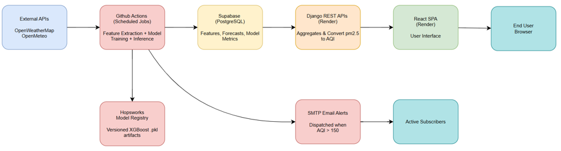

# AQI Predictor

**🚀 Live Production Dashboard:** https://aqi-forecaster-epgh.onrender.com/

An automated, serverless Air Quality Index (AQI) forecasting platform that predicts PM2.5 concentrations up to 72 hours in advance. Built to shift environmental monitoring from historical reporting to proactive health intelligence, providing localized foresight for Islamabad.

## Core Features
* **72-Hour Multi-Horizon Forecasts:** Predicts localized PM2.5 and AQI for Day 1 (+24h), Day 2 (+48h), and Day 3 (+72h) utilizing an XGBoost machine learning model.
* **Generative AI Health Insights:** Integrates Gemini 3.5-Flash to translate raw pollution metrics into relatable "cigarette-equivalent" conversational health warnings.
* **Automated Alerting System:** Dispatches automated SMTP email warnings to subscribers whenever the Day 1 AQI forecast exceeds 150 (Unhealthy).
* **Dynamic UI Feedback:** A React SPA featuring an interactive particle background that visually scales in density and color (green to hazardous red/purple) based on live threat levels.
* **Live ML Diagnostics:** Exposes real-time model evaluation metrics (R², MAE, RMSE) and SHAP feature attribution in a dedicated developer view.

## Tech Stack

| Layer | Technology |
| :--- | :--- |
| **Frontend** | React, Vite, TailwindCSS, Recharts |
| **Backend API** | Django, Django REST Framework |
| **Machine Learning** | Python, XGBoost, SHAP, Scikit-Learn |
| **Databases** | Supabase (PostgreSQL), Hopsworks (Model Registry) |
| **Automation** | GitHub Actions (Cron + `workflow_run` chaining) |
| **External APIs** | Open-Meteo, OpenWeatherMap, Google Gemini |

## System Architecture

The platform operates on a fully decoupled, event-driven MLOps architecture. Heavy computational workloads (historical feature extraction, XGBoost model training, and continuous ML inference) are offloaded to scheduled GitHub Actions pipelines. These background workflows populate a Supabase database and retrieve versioned `.pkl` models dynamically from Hopsworks. The lightweight Django backend serves these pre-computed metrics to the React frontend, ensuring near-instantaneous load times for end users.



## Model Performance Metrics

The predictive engine utilizes a sequential 80/20 train-test split (avoiding random shuffling to prevent future data leakage) and is constrained with deliberate hyperparameters to avoid overfitting the 5-year dataset.

| Horizon | R² Score | MAE (µg/m³) | RMSE (µg/m³) |
| :--- | :--- | :--- | :--- |
| **Day 1 (+24h)** | 0.84 | 20.95 | 30.26 |
| **Day 2 (+48h)** | 0.60 | 34.10 | 48.35 |
| **Day 3 (+72h)** | 0.45 | 40.49 | 56.69 |

## Local Setup & Installation

**1. Clone the repository**
```bash
git clone https://github.com/NazaarKhalid/AQI_forecaster.git
cd AQI_forecaster
```

**2. Backend (Django) Setup**
```bash
cd backend
python -m venv venv
source venv/bin/activate  # On Windows use `venv\Scripts\activate`
pip install -r requirements.txt
python manage.py migrate
python manage.py runserver
```

**3. Frontend (React) Setup**
```bash
cd frontend
npm install
npm run dev
```

## Environment Variables
To run this project locally, create a `.env` file in the root backend directory with the following keys:

**Backend & ML Pipelines**
* `DATABASE_URL` (Supabase connection string)
* `HOPSWORKS_API_KEY`
* `GEMINI_API_KEY`
* `OPENWEATHER_API_KEY`
* `EMAIL_HOST_USER` / `EMAIL_HOST_PASSWORD` (For SMTP alerts)

**Frontend**
Create a `.env` in the frontend directory:
* `VITE_API_BASE_URL` (Set to `http://localhost:8000` for local development)